# 🎭 Multi-Model Debate MCP Server

> **The world's first Model-Agnostic Collaborative AI Council**

Transform AI interaction from copy/paste document shuffling to real-time collaborative discussions between multiple AI models and humans.

[](https://www.python.org/downloads/)
[](LICENSE)
[](https://modelcontextprotocol.io)

## 🚀 What This Is

Instead of this painful workflow:
```
You: *writes idea in Claude Code*
Claude Opus: *responds with deep analysis*
You: *copy/pastes to document*
You: *opens new Claude session with Sonnet*
Claude Sonnet: *different perspective on same idea*  
You: *more copy/pasting between documents*
```

Get this seamless collaboration:
```
You: "Should we rebuild our authentication system using OAuth 2.0?"

Research Lead (Claude Opus): "From a strategic perspective, OAuth 2.0 
addresses enterprise requirements, but we need systematic analysis of 
migration complexity and user impact..."

Engineering (GPT-4): "Implementation-wise, this adds significant 
complexity. Current JWT system works fine - what specific problems 
are we solving? Also consider vendor lock-in risks..."

Product Strategy (Gemini): "Enterprise prospects consistently request 
SSO during sales calls. 67% of deals stall without it. The business 
case is strong if we're targeting B2B expansion..."

Execution (Claude Sonnet): "Let's be practical - current system handles 
50K users reliably. If this is for enterprise sales, focus on Azure AD + 
Google Workspace for 80% coverage..."

You: "It's actually blocking $500K ARR in enterprise deals. Sales needs this by Q2."

Research Lead: "That changes everything - $500K ARR justifies significant investment..."
*[debate continues naturally]*
```

## 🎯 Key Features

- **🤖 Multi-Model Support**: Claude Opus, Claude Sonnet, GPT-4, Gemini - each bringing unique perspectives
- **💬 Real-time Collaboration**: Seamless conversation flow, no copy/pasting between tools  
- **🎭 Intelligent Personas**: Research Lead, Engineering, Product Strategy, Execution perspectives
- **🔌 MCP Integration**: Works with Claude Code, Claude Desktop, and any MCP-compatible client
- **⚙️ Model Agnostic**: Easy to add new LLM providers and models
- **📝 Context Preservation**: Full conversation history maintained across all participants
- **🛠️ Extensible**: Add new personas, models, and debate patterns

## 🏗️ Architecture

```mermaid
graph TB
    User[👤 User] <--> Client[🖥️ Claude Code<br/>MCP Client]
    Client <--> Server[🎭 Multi-Model<br/>Debate Server]
    
    Server --> Orchestrator[🎯 Debate<br/>Orchestrator]
    Server --> Models[🤖 Model<br/>Registry]
    Server --> Context[💾 Conversation<br/>Manager]
    
    Models --> Claude1[Claude Opus 4<br/>Research Lead]
    Models --> GPT[GPT-4<br/>Engineering]  
    Models --> Gemini[Gemini Ultra<br/>Product Strategy]
    Models --> Claude2[Claude Sonnet 4<br/>Execution]
```



## 🚀 Quick Start

### Prerequisites
- Python 3.10+
- API keys for model providers:
  - [Anthropic API Key](https://console.anthropic.com/) (for Claude models)
  - [OpenAI API Key](https://platform.openai.com/api-keys) (for GPT models) 
  - [Google AI API Key](https://makersuite.google.com/app/apikey) (for Gemini models)

### Installation

```bash
# Clone the repository
git clone https://github.com/yourusername/multi-model-debate-mcp
cd multi-model-debate-mcp

# Create virtual environment
python -m venv venv
source venv/bin/activate  # Linux/Mac
# or
venv\Scripts\activate  # Windows

# Install dependencies
pip install -r requirements.txt

# Configure API keys
cp config.example.yaml config.yaml
# Edit config.yaml with your API keys
```

### Configuration

Edit `config.yaml` with your API keys:

```yaml
models:
  claude-opus-4-1:
    provider: "anthropic"
    api_key: "your-anthropic-api-key-here"
    
  gpt-4o:
    provider: "openai"
    api_key: "your-openai-api-key-here"
    
  gemini-ultra:
    provider: "google"
    api_key: "your-google-api-key-here"
```

### Connect to Claude Code

Add to your Claude Code MCP configuration:

```json
{
  "mcpServers": {
    "multi-model-debate": {
      "command": "python",
      "args": ["-m", "multi_model_debate.server"],
      "cwd": "/path/to/multi-model-debate-mcp"
    }
  }
}
```

### Start Your First Debate

```bash
# Run the server
python -m multi_model_debate.server

# In Claude Code, you'll now see multi-model debate tools available
# Start a debate on any topic and watch the magic happen!
```

## 💡 Usage Examples

### Technical Architecture Decision
```
You: "Should we use GraphQL or REST for our new API?"

Research Lead: "This requires systematic analysis of our specific use case. GraphQL offers query flexibility and reduces over-fetching, but adds complexity..."

Engineering: "GraphQL has a steeper learning curve and debugging complexity. REST is proven at scale. What problems are we actually solving?"

Execution: "Our mobile team is already comfortable with REST. GraphQL would require training and new tooling. Is the benefit worth the cost?"
```

### Product Feature Discussion  
```
You: "Should we build native mobile apps or stick with our web app?"

Product Strategy: "User research shows 73% of power users request native apps. App store presence could significantly increase discovery..."

Engineering: "Native development means maintaining iOS + Android codebases. Consider React Native or Flutter for code reuse..."

Execution: "Current team has zero mobile experience. Either we hire mobile devs or plan 6+ month ramp-up time..."
```

## 🎭 Built-in Personas

### 🔬 Research Lead (Claude Opus 4.1)
- Deep analytical thinking
- Long-term strategic perspective  
- Challenges assumptions
- References research and trends
- Systematic problem decomposition

### ⚙️ Engineering (GPT-4)
- Technical feasibility focus
- Performance and scalability concerns
- Implementation complexity analysis
- Risk assessment
- Developer experience considerations

### 🎯 Product Strategy (Gemini Ultra)
- User experience advocacy
- Market and competitive analysis
- Business impact evaluation
- Success metrics focus
- Customer needs prioritization

### ✅ Execution (Claude Sonnet 4)
- Practical feasibility assessment
- Resource and timeline constraints
- Action-oriented solutions
- Dependency identification
- "Good enough" pragmatism

## 🛠️ Customization

### Add New Models
```yaml
# In config.yaml
models:
  claude-haiku:
    provider: "anthropic"
    api_key: "${ANTHROPIC_API_KEY}"
    model_id: "claude-3-haiku-20240307"
    
  gpt-3.5-turbo:
    provider: "openai"
    api_key: "${OPENAI_API_KEY}" 
    model_id: "gpt-3.5-turbo"
```

### Create Custom Personas
```yaml
# In config.yaml
personas:
  security_expert:
    name: "Security Expert"
    prompt: |
      You are the Security Expert in this discussion. Focus on:
      - Security vulnerabilities and risks
      - Compliance requirements  
      - Data protection concerns
      - Authentication and authorization
      - Threat modeling and mitigation
```

### Define Debate Templates
```yaml
# In config.yaml  
default_debates:
  security_review:
    participants: ["security_expert", "engineering", "execution"]
    description: "Security architecture and threat analysis"
    
  user_research:
    participants: ["product_strategy", "research_lead"] 
    description: "User experience and market research discussions"
```

## 🔧 Advanced Features

### Multi-Provider Orchestration
Seamlessly mix and match models from different providers in the same debate:
- **Anthropic models**: Constitutional AI, safety-focused reasoning
- **OpenAI models**: Creative problem-solving, broad knowledge
- **Google models**: Multi-modal capabilities, search integration
- **Future providers**: Easy to add new LLM providers

### Context Management
- **Persistent conversations**: Full debate history maintained across sessions
- **Smart context windowing**: Relevant conversation history included for each model
- **Cross-model context sharing**: Models can reference and build on each other's points

### Extensible Architecture
- **Plugin system**: Add new model providers with minimal code
- **Custom personas**: Define specialized roles for your domain
- **Debate patterns**: Create templates for recurring discussion types
- **Integration hooks**: Connect with external systems and data sources

## 📊 Why This Matters

### The Problem
Current AI workflows are fragmented:
- ❌ Copy/paste between different AI tools
- ❌ Lost context when switching models  
- ❌ No collaboration between AI perspectives
- ❌ Sequential handoffs instead of real discussion
- ❌ User as middleman, not participant

### The Solution  
True collaborative AI intelligence:
- ✅ Real-time multi-model conversations
- ✅ Preserved context across all participants
- ✅ Different AI architectures contributing unique perspectives  
- ✅ Human as equal participant in the discussion
- ✅ Seamless integration with existing tools

### The Impact
- **Better decisions**: Multi-perspective analysis reveals blind spots
- **Faster iteration**: No context switching or manual coordination
- **Enhanced creativity**: Models spark ideas off each other
- **Reduced cognitive load**: AI handles perspective management
- **Scalable wisdom**: Easily add new viewpoints and expertise

## 🚗 Roadmap

### Phase 1: Foundation (Current)
- [x] Multi-Claude support (Opus + Sonnet)
- [x] MCP server architecture
- [x] Basic conversation management
- [x] Core persona system

### Phase 2: Multi-Provider (Next)  
- [ ] OpenAI GPT-4 integration
- [ ] Google Gemini integration  
- [ ] Universal model interface
- [ ] Advanced error handling

### Phase 3: Intelligence (Future)
- [ ] Dynamic model selection based on topic
- [ ] Debate analytics and insights
- [ ] Learning from conversation patterns
- [ ] Integration with external data sources

### Phase 4: Ecosystem (Long-term)
- [ ] Visual debate interface
- [ ] Mobile client support  
- [ ] Enterprise features and security
- [ ] Community-contributed personas and models

## 🤝 Contributing

This project welcomes contributions! We're building the future of human-AI collaboration.

### Ways to Contribute
- **🔌 Model Integrations**: Add support for new LLM providers
- **🎭 Personas**: Create specialized role definitions  
- **🎨 UX Improvements**: Better conversation formatting and presentation
- **⚡ Performance**: Optimization and caching improvements
- **📚 Documentation**: Tutorials, examples, best practices
- **🐛 Bug Fixes**: Issues, edge cases, error handling

### Development Setup
```bash
# Fork and clone
git clone https://github.com/yourusername/multi-model-debate-mcp
cd multi-model-debate-mcp

# Install development dependencies
pip install -r requirements-dev.txt

# Run tests
python -m pytest tests/

# Code formatting  
black multi_model_debate/
mypy multi_model_debate/
```

See [CONTRIBUTING.md](CONTRIBUTING.md) for detailed guidelines.

## 📄 License

This project is licensed under the MIT License - see the [LICENSE](LICENSE) file for details.

## 🙏 Acknowledgments

- **Anthropic** for the Model Context Protocol and Claude models
- **The MCP Community** for architectural patterns and inspiration  
- **OpenAI, Google, and other LLM providers** for making powerful models accessible
- **Early contributors and testers** who help shape the future of collaborative AI

## 📞 Support

- **GitHub Issues**: Bug reports and feature requests
- **Discussions**: Questions and community support
- **Documentation**: Comprehensive guides and examples
- **Examples**: Real-world usage patterns and templates

---

## ⭐ Star This Repository

If you find this project interesting or useful, please star it! It helps others discover this new approach to AI collaboration.

**This isn't just another AI tool - it's a new way of thinking about human-AI collaboration. Instead of using AI, you're collaborating with AI.**

Ready to revolutionize how you work with AI? [Get started now!](#-quick-start)

---

*Built with ❤️ by pioneers in collaborative intelligence*