# 🎭 Multi-Model Debate MCP Server

> **Real-time collaborative AI discussion platform using Mattermost + Claude**

Transform AI collaboration from isolated conversations to shared team discussions where AI models participate as team members alongside humans.

[](https://www.python.org/downloads/)
[](LICENSE)
[](https://modelcontextprotocol.io)

## 🚀 What This Actually Is

A **working MCP server** that enables real-time collaborative discussions between humans and AI in Mattermost channels:

```
Human: "Should we rebuild our auth system with OAuth 2.0?"

claude-research: "From a strategic perspective, OAuth 2.0 addresses
enterprise requirements and reduces user friction, but we need to
systematically analyze migration complexity..."

kiro: "Let's be practical - current system handles 50K users fine.
If this is for specific enterprise deals, let's focus on Azure AD
+ Google Workspace for 80% coverage first..."
```

## ✅ Current Features (What Actually Works)

- **🤖 Claude Integration**: Uses Anthropic API for AI responses
- **💬 Mattermost Integration**: Real-time team chat with AI participants
- **🎭 Two Personas**: claude-research (analytical) and kiro (practical execution)
- **🔔 Real-time Notifications**: WebSocket-based message updates
- **🔌 MCP Compatibility**: Works with Claude Code and any MCP-compatible client
- **📝 Context Preservation**: Full conversation history maintained in Mattermost
- **⚡ Live Collaboration**: No copy/paste - AI responds directly in team chat

## 🏗️ Current Architecture

```mermaid
graph TB
    User[👤 User] <--> Client[🖥️ Claude Code<br/>MCP Client]
    Client <--> Server[🎭 MCP Server<br/>Python]

    Server --> MM[💬 Mattermost<br/>Team Chat]
    Server --> Claude[🤖 Claude API<br/>Anthropic]

    MM --> Personas[🎭 AI Personas<br/>claude-research + kiro]
    Claude --> Responses[💭 AI Responses<br/>Context-Aware]
```



## 🛠️ Available MCP Tools

1. **`read_discussion`** - Read recent team discussion messages
2. **`contribute`** - Post message as specific AI persona
3. **`get_conversation_context`** - Get structured conversation summary
4. **`subscribe_notifications`** - Subscribe to real-time message updates
5. **`unsubscribe_notifications`** - Unsubscribe from notifications

## 🚀 Quick Start

### Prerequisites
- Python 3.10+
- [Mattermost server](https://docs.mattermost.com/guides/deployment.html) (local or hosted)
- [Anthropic API Key](https://console.anthropic.com/)
- Mattermost bot tokens for AI personas

### 1. Environment Setup

```bash
# Clone repository
git clone <repository-url>
cd multi-model-debate-mcp

# Install dependencies
pip install -r requirements.txt

# Configure environment variables
cp .env.example .env
# Edit .env with your credentials
```

### 2. Required Environment Variables

```bash
# Anthropic API for AI responses
ANTHROPIC_API_KEY=your_anthropic_api_key_here

# Mattermost bot tokens (create in Mattermost admin)
CLAUDE_RESEARCH_BOT_TOKEN=your_claude_research_bot_token
KIRO_BOT_TOKEN=your_kiro_bot_token

# Mattermost server connection
MATTERMOST_URL=localhost  # or your-mattermost-domain.com
MATTERMOST_PORT=8065
MATTERMOST_SCHEME=http    # or https
```

### 3. Start the Server

```bash
# Run MCP server
python src/mcp_server.py

# Or use entry point
python main.py
```

### 4. Connect to Claude Code

Add to your Claude Code MCP configuration:

```json
{
  "mcpServers": {
    "multi-model-debate": {
      "command": "python",
      "args": ["src/mcp_server.py"],
      "cwd": "/path/to/multi-model-debate-mcp"
    }
  }
}
```

## 💡 Usage Examples

### Start a Team Discussion

In Claude Code with MCP tools:

```
Use: contribute
Message: "Should we implement rate limiting for our API?"
Persona: claude-research

→ AI posts to Mattermost as claude-research with analytical perspective
→ Team members can respond directly in Mattermost
→ Use read_discussion to see latest conversation
```

### Monitor Real-time Discussion

```
Use: subscribe_notifications
→ Enables real-time message updates

Use: read_discussion
Limit: 10
→ Shows last 10 messages with context

Use: get_conversation_context
→ Provides conversation summary and key points
```

## 🎭 AI Personas

### claude-research
- **Role**: Analytical research and strategic thinking
- **Style**: Deep analysis, references research, asks probing questions
- **Use for**: Complex problem analysis, strategic decisions, technical research

### kiro
- **Role**: Practical execution and pragmatic solutions
- **Style**: Action-oriented, considers constraints, focuses on "good enough"
- **Use for**: Implementation planning, timeline reality checks, practical decisions

## ⚙️ Configuration

Edit `config/chat_coordination_rules.yaml` to customize:

- AI persona definitions and behaviors
- Autonomous collaboration settings
- Channel and team configurations
- Response patterns and rules

## 🔧 Technical Details

- **MCP Protocol**: JSON-RPC over stdio
- **AI Provider**: Anthropic Claude (Sonnet 4)
- **Chat Platform**: Mattermost via HTTP API
- **Notifications**: WebSocket connections for real-time updates
- **State Management**: Conversation context in Mattermost history

## 🚫 What This Is NOT (Yet)

This is **not** the multi-provider AI debate system described in some documentation. Current limitations:

- ❌ No OpenAI/GPT-4 integration
- ❌ No Google Gemini integration
- ❌ No automated multi-AI debates
- ❌ No specialized personas beyond claude-research/kiro

For the roadmap vision, see `roadmap/FUTURE_VISION.md`.

## 🐛 Troubleshooting

### Common Issues

**MCP tools not working:**
- Verify server is running: `python src/mcp_server.py`
- Check Claude Code MCP configuration
- Restart Claude Code after server changes

**Mattermost connection failed:**
- Verify Mattermost server is running
- Check bot tokens in .env file
- Ensure bots have channel access permissions

**AI responses not generating:**
- Verify ANTHROPIC_API_KEY in .env
- Check API key has sufficient credits
- Review server logs for error messages

## 📊 Server Status Validation

Test all MCP tools are working:

```python
# Use Claude Code or run directly:
mcp__multi-model-debate__read_discussion
mcp__multi-model-debate__subscribe_notifications
mcp__multi-model-debate__contribute
mcp__multi-model-debate__get_conversation_context
```

## 🤝 Contributing

Current development focus:
- **Stability improvements** for existing Mattermost integration
- **Better error handling** and user feedback
- **Enhanced persona definitions** and response quality
- **Documentation updates** to match reality

## 📄 License

MIT License - See LICENSE file for details.

## 🙏 Acknowledgments

- **Anthropic** for Claude API and Model Context Protocol
- **Mattermost** for the team collaboration platform
- **MCP Community** for integration patterns

---

**Current Status**: ✅ **OPERATIONAL** - Ready for team collaboration with claude-research and kiro personas.

For setup help: `docs/setup/` | For future plans: `docs/roadmap/`